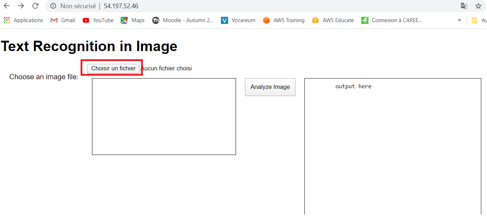

# AWS_Boto3_textDetection

Using Rekognition from AWS boto3 to detect text in an image.  

## Expected output

From your web browser, you will be able to load an image and extract the text from a picture.

## AWS Architecture

A VPC, an internet gateway, 2 public subnets.  
A public instance to host our web server.  
A public instance to host our web application (using Flask).

## Steps we will follow

1- Run a web server to display our html page where the user can upload an image. This server passes the image to the Flask app, which then uses boto3 to analyze the image and extract text. The result is then passed back to the web page, which displays the extracted text.

2- Run the Flask app on a different instance. This app listens to incoming requests from the web server, processes the request and sends the results back. Image analysis is done using the boto3 Rekognition client.

## Prerequisites

Create a VPC, attach an internet gateway and create two subnets.  
Subnet 1 routes 0.0.0.0/0 trafic to the internet gateway.  
You can leave default setting for subnet 2.

## Creating the web App instance

We're starting with this step because we'll need this instance's public IP to be referenced in our html document hosted on the web server instance.

Instance Type: Amazon Linux 2 AMI  
Subnet: Subnet 2  
Configure its Security Group to accept inbound Custom TCP on port 5000.

copy the file main.py to this instance.  

Run the following commands:  
$ sudo yum update -y  
$ sudo yum install python-pip  
$ sudo pip install Flask  
$ sudo pip install boto3

Some additional python packages are needed in the code but they should come with the default installation (re, base64).

Note:  
boto3 needs your aws credentials to run properly. Those may be hard coded in the Python script (NOT RECOMMENDED) or stored in a credentials file located in ~/.aws/credentials and ~/.aws/config.  
For this project, I had to hard code the credentials in the Python script as boto3 wasn't able to locate the credentials file properly. This is far from ideal but good enough for a dev set up.  

You can now run the App:  
$ sudo python main.py  

## Creating the web server

Instance Type: Amazon Linux 2 AMI  
Subnet: Subnet 1  
Configure its Security Group to accept inbound HTTP and HTTPS on top of SSH

Copy index.html to this Instance. Make sure to change the default IP address in the html script to the public IP address of your web App instance.

1- copy index.html to this instance

We can now install Apache and copy index.html to the appropriate location for Apache to serve our page.  

2- Run the following commands:  
$ sudo yum update -y  
$ sudo yum -y install httpd php  
$ sudo chkconfig httpd on  
$ sudo scp index.html /var/www/html/index.html  
$ sudo service httpd start

## Check results

From your web browser, navigate to the public IP address of your web server. The following page should appear.

Select a file from your hard drive. And click Analyze Image. The extracted text will be displayed in the textarea located on the right.

